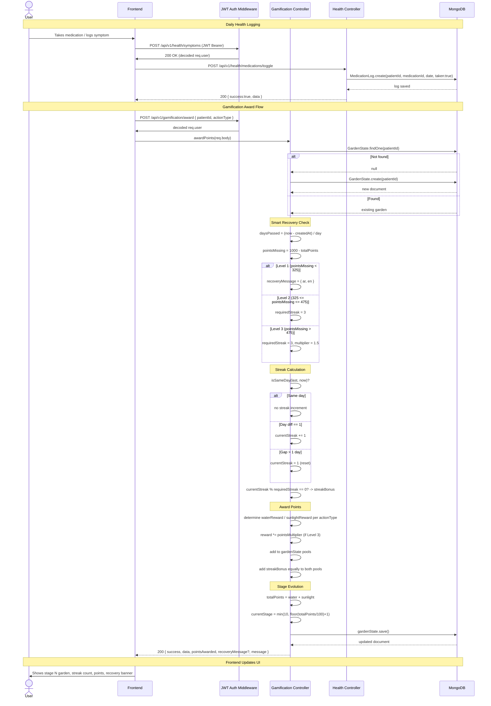

# Brain Care Backend — Technical Documentation

## 1. System Overview

**Brain Care Backend** is a Node.js/Express 5 microservice that powers a gamified brain-health tracking platform. It integrates daily health logging, medication/prescription management, patient–doctor linking, and a psychologically-informed gamification system ("The Hope Garden") that rewards adherence with virtual water/sunlight points and stage progression.

### Tech Stack

| Layer | Technology |
|-------|-----------|
| Runtime | Node.js (CommonJS) |
| Framework | Express 5 |
| Database | MongoDB (via Mongoose 9 ODM) |
| Auth | JWT (jsonwebtoken) — bearer token verification |
| Security | Helmet (HTTP headers), CORS, express-rate-limit |
| Dev Tooling | Nodemon, dotenv |

### Architecture Diagram

```
┌─────────────┐     JWT Bearer      ┌─────────────────────────────────────┐
│   Frontend   │ ──────────────────> │         Express 5 Server            │
│   (Client)   │                     │  Port 5000  (0.0.0.0)              │
└─────────────┘                     │                                     │
        │                            │  ├── authMiddleware ── verifies JWT │
        │                            │  ├── helmet / cors / rate-limit    │
        ▼                            │  └── route modules:                │
                                      │       ├── /api/v1/gamification    │
                                      │       ├── /api/v1/health          │
                                      │       ├── /api/v1/prescriptions   │
                                      │       ├── /api/v1/links           │
                                      │       └── /api/v1/logs/symptoms   │
                                      │                                   │
                                      └──────────┬────────────────────────┘
                                                 │
                                                 ▼
                                      ┌─────────────────────┐
                                      │     MongoDB Atlas    │
                                      │  (brain_care DB)     │
                                      │                     │
                                      │ Collections:         │
                                      │  ┌───────────────┐  │
                                      │  │ GardenState   │  │
                                      │  ├───────────────┤  │
                                      │  │ Prescription  │  │
                                      │  ├───────────────┤  │
                                      │  │ SymptomLog    │  │
                                      │  ├───────────────┤  │
                                      │  │ Medication    │  │
                                      │  ├───────────────┤  │
                                      │  │ MedicationLog │  │
                                      │  ├───────────────┤  │
                                      │  │ PatientDoctor │  │
                                      │  │ Link          │  │
                                      │  ├───────────────┤  │
                                      │  │ DailySymptom  │  │
                                      │  │ Log           │  │
                                      │  └───────────────┘  │
                                      └─────────────────────┘
```

---

## 2. Mermaid Diagrams

### 2.1 Entity-Relationship Diagram (ERD)

```mermaid
erDiagram
    Patient ||--o| GardenState : has
    Patient ||--o{ Prescription : receives
    Patient ||--o{ Medication : takes
    Patient ||--o{ MedicationLog : logs
    Patient ||--o{ SymptomLog : logs-daily
    Patient ||--o{ DailySymptomLog : logs-free
    Patient ||--o{ PatientDoctorLink : linked-to
    Doctor  ||--o{ Prescription : writes
    Doctor  ||--o{ PatientDoctorLink : treats

    Medication ||--o{ MedicationLog : tracked-by

    Patient {
        string id "from JWT sub"
    }

    Doctor {
        string id "from JWT sub"
    }

    GardenState {
        string patientId PK, FK
        number waterPoints "default 0"
        number sunlightPoints "default 0"
        number currentStage "0-100"
        number currentStreak "consecutive days"
        date lastInteractionTimestamp
        date createdAt
        date updatedAt
    }

    Prescription {
        objectId _id
        string doctorId FK
        string patientId FK
        string medicationName
        string dosage
        object frequency "{ type, schedules[] }"
        string type "course | prn"
        number durationDays
        string notes "optional doctor notes"
        string status "active | inactive"
        boolean isActive
        date createdAt
        date updatedAt
    }

    Medication {
        objectId _id
        string patientId FK
        string name
        string reminderTime
        number hour "0-23"
        number minute "0-59"
        boolean isActive
        number durationInDays "default 60"
        date startDate
        date createdAt
        date updatedAt
    }

    MedicationLog {
        objectId _id
        string patientId FK
        objectId medicationId FK
        string date "YYYY-MM-DD"
        boolean taken "default false"
        date createdAt, updatedAt
    }

    SymptomLog {
        objectId _id
        string patientId FK
        string date "YYYY-MM-DD | unique per patient"
        string[] symptoms "enum-constrained"
        date createdAt, updatedAt
    }

    DailySymptomLog {
        objectId _id
        string patientId FK
        string symptom "free text"
        date loggedAt "default now"
        date createdAt, updatedAt
    }

    PatientDoctorLink {
        objectId _id
        string patientId FK
        string patientName
        string doctorId FK
        date createdAt, updatedAt
    }
```

### 2.2 Sequence Diagram — "The Hope Garden" Complete Flow



---

## 3. Database Schemas

### 3.1 — GardenState (`GardenState` collection)

Tracks the patient's virtual "Hope Garden" progression. Dormancy-safe (points never decrease).

| Field | Type | Required | Default | Description |
|-------|------|----------|---------|-------------|
| `patientId` | `String` | ✅ | — | Unique patient identifier (from JWT) |
| `waterPoints` | `Number` | ❌ | `0` | Water-based reward pool |
| `sunlightPoints` | `Number` | ❌ | `0` | Sunlight-based reward pool |
| `currentStage` | `Number` | ❌ | `0` | Garden stage (1–10 computed as `floor(total/100)+1`, max 100) |
| `currentStreak` | `Number` | ❌ | `0` | Consecutive daily interaction count |
| `lastInteractionTimestamp` | `Date` | ❌ | `Date.now` | Last time points were awarded |
| `createdAt` | `Date` | auto | Mongoose | Document creation time |
| `updatedAt` | `Date` | auto | Mongoose | Last update time |

**Indexes:** `patientId` (unique)

#### Reward Rules

| Action Type | Pool | Base Points | After Level-3 Multiplier (1.5x) |
|-------------|------|-------------|----------------------------------|
| `medication` | Sunlight | 10 | 15 |
| `symptom` | Water | 5 | 8 (rounded) |
| `chat` | Water | 5 | 8 (rounded) |

#### Streak Bonus

- **Normal:** Every 7 days → +25 points to **both** pools
- **Level 2 Recovery:** Every 3 days → +25 points to **both** pools
- **Level 3 Recovery:** Every 3 days → +25 points to **both** pools (plus 1.5x action multiplier)

#### Stage Calculation

```
currentStage = Math.min(10, Math.floor(totalPoints / 100) + 1)
```

| Total Points | Stage |
|-------------|-------|
| 0–99 | 1 |
| 100–199 | 2 |
| 200–299 | 3 |
| 300–399 | 4 |
| 400–499 | 5 |
| 500–599 | 6 |
| 600–699 | 7 |
| 700–799 | 8 |
| 800–899 | 9 |
| 900–1000 | 10 |

#### Smart Recovery Algorithm (Days 45–60)

| Level | Condition | `requiredStreak` | `pointsMultiplier` | Behavior |
|-------|-----------|-----------------|-------------------|----------|
| 1 — Struggling Lightly | `pointsMissing < 325` | 7 (unchanged) | 1 | Returns i18n encouragement message |
| 2 — Intensive Care | `325 ≤ pointsMissing ≤ 475` | 3 | 1 | Accelerated streak bonus cycle |
| 3 — Special Mission | `pointsMissing > 475` | 3 | 1.5 | Accelerated streak + points boost |

---

### 3.2 — Prescription (`Prescriptions` collection)

| Field | Type | Required | Default | Description |
|-------|------|----------|---------|-------------|
| `doctorId` | `String` | ✅ | — | Doctor who prescribed |
| `patientId` | `String` | ✅ | — | Patient receiving the prescription |
| `medicationName` | `String` | ✅ | — | Name of the medication |
| `dosage` | `String` | ✅ | — | Dosage instructions (e.g., "500mg") |
| `frequency.type` | `String` | ✅ | — | Frequency type (e.g., "daily", "twice_daily") |
| `frequency.schedules` | `[String]` | ❌ | `[]` | Specific times (e.g., ["08:00", "20:00"]) |
| `notes` | `String` | ❌ | — | Optional doctor's custom instructions (free text) |
| `type` | `String` (`course`/`prn`) | ❌ | `'course'` | Prescription type |
| `durationDays` | `Number` | ❌ | — | How long the prescription lasts |
| `status` | `String` (`active`/`inactive`) | ❌ | `'active'` | Current status |
| `isActive` | `Boolean` | ❌ | `true` | Redundant active flag |
| `createdAt` | `Date` | auto | Mongoose | Prescription creation date |
| `updatedAt` | `Date` | auto | Mongoose | Last update |

**Indexes:** `doctorId`, `patientId`

---

### 3.3 — Medication (`Medications` collection)

| Field | Type | Required | Default | Description |
|-------|------|----------|---------|-------------|
| `patientId` | `String` | ✅ | — | Patient identifier |
| `name` | `String` | ✅ | — | Medication name |
| `reminderTime` | `String` | ✅ | — | Human-readable reminder (e.g., "Morning") |
| `hour` | `Number` | ✅ | — | Hour for reminder (0–23) |
| `minute` | `Number` | ✅ | — | Minute for reminder (0–59) |
| `isActive` | `Boolean` | ❌ | `true` | Whether medication is still active |
| `durationInDays` | `Number` | ❌ | `60` | Expected course duration |
| `startDate` | `Date` | ❌ | `Date.now` | When the medication course started |
| `createdAt` | `Date` | auto | Mongoose | Document creation time |
| `updatedAt` | `Date` | auto | Mongoose | Last update |

**Indexes:** `patientId`

---

### 3.4 — MedicationLog (`MedicationLogs` collection)

| Field | Type | Required | Default | Description |
|-------|------|----------|---------|-------------|
| `patientId` | `String` | ✅ | — | Patient identifier |
| `medicationId` | `ObjectId` (ref: Medication) | ✅ | — | Reference to the Medication |
| `date` | `String` | ✅ | — | Date in `YYYY-MM-DD` format |
| `taken` | `Boolean` | ❌ | `false` | Whether the dose was taken |
| `createdAt` | `Date` | auto | Mongoose | Log creation time |
| `updatedAt` | `Date` | auto | Mongoose | Last update |

**Indexes:** `{ medicationId: 1, date: 1 }` (unique compound index — one log per medication per day)

---

### 3.5 — SymptomLog (`SymptomLogs` collection)

Structured daily symptom log with constrained enum values.

| Field | Type | Required | Default | Description |
|-------|------|----------|---------|-------------|
| `patientId` | `String` | ✅ | — | Patient identifier |
| `date` | `String` | ✅ | — | Date in `YYYY-MM-DD` format |
| `symptoms` | `[String]` | ❌ | — | Array of symptom enums (see below) |
| `createdAt` | `Date` | auto | Mongoose | Document creation time |
| `updatedAt` | `Date` | auto | Mongoose | Last update |

**Enum Values:** `headache`, `dizziness`, `memory_lapse`, `fatigue`, `nausea`, `vision_changes`, `seizures`, `balance_issues`, `speech_difficulty`

**Indexes:** `{ patientId: 1, date: 1 }` (unique compound index — one log per patient per day)

---

### 3.6 — DailySymptomLog (`DailySymptomLogs` collection)

Free-text per-entry symptom logging (no enum constraint, no date uniqueness).

| Field | Type | Required | Default | Description |
|-------|------|----------|---------|-------------|
| `patientId` | `String` | ✅ | — | Patient identifier |
| `symptom` | `String` | ✅ | — | Free-text symptom description |
| `loggedAt` | `Date` | ❌ | `Date.now` | Timestamp of the log entry |
| `createdAt` | `Date` | auto | Mongoose | Document creation time |
| `updatedAt` | `Date` | auto | Mongoose | Last update |

**Indexes:** `patientId`

---

### 3.7 — PatientDoctorLink (`PatientDoctorLinks` collection)

Links a patient to their treating doctor.

| Field | Type | Required | Default | Description |
|-------|------|----------|---------|-------------|
| `patientId` | `String` | ✅ | — | Patient identifier |
| `patientName` | `String` | ✅ | — | Patient's display name |
| `doctorId` | `String` | ✅ | — | Doctor identifier |
| `createdAt` | `Date` | auto | Mongoose | Link creation time |
| `updatedAt` | `Date` | auto | Mongoose | Last update |

**Indexes:** `{ patientId: 1, doctorId: 1 }` (unique compound index), `doctorId`

---

## 4. API Endpoints

All endpoints are prefixed with the base path and require JWT Bearer authentication via `auth` middleware.

> **Common headers:** `Authorization: Bearer <token>`
>
> **Common request Content-Type:** `application/json`
>
> **Common response envelope:**
> ```json
> { "success": true|false, "data": {...}, "message": "..." }
> ```

---

### 4.1 — Gamification — `/api/v1/gamification`

#### GET `/:patientId` — Get Garden State

Retrieves the patient's Hope Garden. Auto-creates if it does not exist.

**Params:** `patientId` (URL param, must match JWT sub)

**Response 200:**
```json
{
  "success": true,
  "data": {
    "patientId": "usr_123",
    "waterPoints": 45,
    "sunlightPoints": 30,
    "currentStage": 1,
    "currentStreak": 3,
    "lastInteractionTimestamp": "2026-06-29T10:30:00.000Z",
    "createdAt": "2026-06-01T08:00:00.000Z",
    "updatedAt": "2026-06-29T10:30:00.000Z",
    "daysSinceLastInteraction": 0
  }
}
```

---

#### POST `/award` — Award Points

Awards points for a completed health action.

**Request Body:**
```json
{
  "patientId": "usr_123",
  "actionType": "medication"
}
```

**`actionType` values:** `medication` | `symptom` | `chat`

**Response 200 (normal, no streak bonus):**
```json
{
  "success": true,
  "data": {
    "patientId": "usr_123",
    "waterPoints": 45,
    "sunlightPoints": 40,
    "currentStage": 1,
    "currentStreak": 4,
    "lastInteractionTimestamp": "2026-06-29T10:35:00.000Z",
    "createdAt": "2026-06-01T08:00:00.000Z",
    "updatedAt": "2026-06-29T10:35:00.000Z"
  },
  "pointsAwarded": 10,
  "message": "Awarded 10 sunlight (Day 4 streak)"
}
```

**Response 200 (with streak bonus):**
```json
{
  "success": true,
  "data": { ... },
  "pointsAwarded": 10,
  "message": "Awarded 10 sunlight + 25 streak bonus (Day 7 streak)"
}
```

**Response 200 (with Level 1 recovery encouragement):**
```json
{
  "success": true,
  "data": { ... },
  "pointsAwarded": 5,
  "recoveryMessage": {
    "ar": "أنت على بُعد خطوات من اكتمال حديقتك، التزامك في الـ 15 يوماً القادمة يضمن لك الهدف!",
    "en": "You are just steps away from completing your garden! Your commitment over the next 15 days ensures your goal."
  },
  "message": "Awarded 5 water (Day 12 streak)"
}
```

**Response 400:**
```json
{ "success": false, "message": "patientId and actionType are required" }
```

---

#### PUT `/reset/:patientId` — Reset Garden State

Resets all points, stage, and streak to zero.

**Params:** `patientId` (URL param, must match JWT sub)

**Response 200:**
```json
{
  "success": true,
  "message": "Garden reset successfully",
  "data": {
    "patientId": "usr_123",
    "waterPoints": 0,
    "sunlightPoints": 0,
    "currentStage": 0,
    "currentStreak": 0,
    "lastInteractionTimestamp": "2026-06-29T10:40:00.000Z",
    "createdAt": "2026-06-01T08:00:00.000Z",
    "updatedAt": "2026-06-29T10:40:00.000Z"
  }
}
```

---

### 4.2 — Health Tracking — `/api/v1/health`

#### POST `/symptoms` — Log Daily Symptoms

Upserts a structured symptom log for the current patient on the given date.

**Request Body:**
```json
{
  "date": "2026-06-29",
  "symptoms": ["headache", "fatigue"]
}
```

**Response 200:**
```json
{
  "success": true,
  "data": {
    "patientId": "usr_123",
    "date": "2026-06-29",
    "symptoms": ["headache", "fatigue"],
    "_id": "..."
  }
}
```

---

#### POST `/medications` — Add a Medication

**Request Body:**
```json
{
  "name": "Aspirin",
  "reminderTime": "Morning",
  "hour": 8,
  "minute": 0
}
```

**Response 201:**
```json
{
  "success": true,
  "data": {
    "patientId": "usr_123",
    "name": "Aspirin",
    "reminderTime": "Morning",
    "hour": 8,
    "minute": 0,
    "isActive": true,
    "durationInDays": 60,
    "startDate": "2026-06-29T...",
    "_id": "..."
  }
}
```

---

#### POST `/medications/toggle` — Toggle Medication Log

Creates a `taken: true` log or toggles the existing one (taken → not taken).

**Request Body:**
```json
{
  "medicationId": "60d...",
  "date": "2026-06-29"
}
```

**Response 200:**
```json
{
  "success": true,
  "data": {
    "patientId": "usr_123",
    "medicationId": "60d...",
    "date": "2026-06-29",
    "taken": true,
    "_id": "..."
  }
}
```

---

#### GET `/summary` — Get Patient Health Summary

Returns active medications, today's medication logs, and today's symptom log in a single call.

**Response 200:**
```json
{
  "success": true,
  "data": {
    "medications": [ { ... } ],
    "todayMedicationLogs": [ { ... } ],
    "todaySymptomLog": { ... }
  }
}
```

---

### 4.3 — Prescriptions — `/api/v1/prescriptions`

#### POST `/` — Add a Prescription

**Request Body:**
```json
{
  "doctorId": "doc_456",
  "patientId": "usr_123",
  "medicationName": "Amoxicillin",
  "dosage": "500mg",
  "frequency": {
    "type": "twice_daily",
    "schedules": ["08:00", "20:00"]
  },
  "type": "course",
  "durationDays": 7,
  "notes": "Take with food"
}
```

**Response 201:**
```json
{
  "success": true,
  "data": {
    "doctorId": "doc_456",
    "patientId": "usr_123",
    "medicationName": "Amoxicillin",
    "dosage": "500mg",
    "frequency": {
      "type": "twice_daily",
      "schedules": ["08:00", "20:00"]
    },
    "type": "course",
    "durationDays": 7,
    "notes": "Take with food",
    "status": "active",
    "isActive": true,
    "_id": "...",
    "createdAt": "...",
    "updatedAt": "..."
  }
}
```

---

#### GET `/:patientId` — Get Patient Prescriptions

Returns all prescriptions for a patient, sorted newest-first. Performs a lazy auto-expire check on read: prescriptions past their duration are marked `inactive`.

**Response 200:**
```json
{
  "success": true,
  "data": [
    { "medicationName": "Amoxicillin", "status": "active", ... },
    { "medicationName": "Ibuprofen", "status": "inactive", ... }
  ]
}
```

---

#### PATCH `/:id/status` — Update Prescription Status

**Request Body:**
```json
{ "status": "inactive" }
```

**Response 200:**
```json
{
  "success": true,
  "data": { "_id": "...", "status": "inactive", ... }
}
```

---

#### DELETE `/:id` — Delete Prescription

**Response 200:**
```json
{
  "success": true,
  "message": "Prescription deleted successfully"
}
```

---

### 4.4 — Patient–Doctor Links — `/api/v1/links`

#### POST `/` — Link Patient to Doctor

Creates a link if it does not already exist.

**Request Body:**
```json
{
  "patientId": "usr_123",
  "patientName": "John Doe",
  "doctorId": "doc_456"
}
```

**Response 201 (new):**
```json
{
  "success": true,
  "data": {
    "patientId": "usr_123",
    "patientName": "John Doe",
    "doctorId": "doc_456",
    "_id": "...",
    "createdAt": "...",
    "updatedAt": "..."
  }
}
```

**Response 200 (existing):**
```json
{
  "success": true,
  "data": { ... },
  "message": "Link already exists"
}
```

---

#### GET `/:doctorId/patients` — Get All Patients for a Doctor

**Response 200:**
```json
{
  "success": true,
  "data": [
    { "patientId": "usr_123", "patientName": "John Doe", "doctorId": "doc_456" }
  ]
}
```

---

### 4.5 — Daily Symptom Logs — `/api/v1/logs/symptoms`

#### POST `/` — Log a Free-Text Symptom

**Request Body:**
```json
{
  "patientId": "usr_123",
  "symptom": "Felt dizzy after standing up"
}
```

**Response 201:**
```json
{
  "success": true,
  "data": {
    "patientId": "usr_123",
    "symptom": "Felt dizzy after standing up",
    "loggedAt": "2026-06-29T10:45:00.000Z",
    "_id": "..."
  }
}
```

---

#### GET `/:patientId` — Get Symptom History

Returns all symptom entries for a patient, newest first.

**Response 200:**
```json
{
  "success": true,
  "data": [
    { "symptom": "Felt dizzy after standing up", "loggedAt": "...", ... }
  ]
}
```

---

#### DELETE `/` — Remove a Symptom Log

**Request Body:**
```json
{
  "patientId": "usr_123",
  "symptom": "Felt dizzy after standing up"
}
```

**Response 200:**
```json
{
  "success": true,
  "message": "Symptom log removed successfully"
}
```

---

## 5. Error Handling

All errors are centralized in `middlewares/errorMiddleware.js`:

| Scenario | HTTP Status | `success` | `message` |
|----------|-------------|-----------|-----------|
| Missing auth token | 401 | `false` | `"No token provided"` |
| Expired token | 401 | `false` | `"Token expired"` |
| Invalid token | 403 | `false` | `"Invalid token"` |
| Validation failure (missing fields) | 400 | `false` | Field-specific message |
| Resource not found | 404 | `false` | `"Prescription not found"` etc. |
| Forbidden (cross-user access) | 403 | `false` | `"Forbidden: cannot access another user's garden"` |
| Unhandled server error | 500 | `false` | Error message (stack only in dev) |
| Rate limit (when enabled) | 429 | `false` | `"Too many requests from this IP..."` |

---

## 6. Security & Configuration

| Concern | Implementation |
|---------|---------------|
| Auth | JWT Bearer token verification via `jsonwebtoken` |
| Secrets | `.env` file: `JWT_SECRET`, `MONGO_URI` |
| HTTP Security | Helmet middleware (XSS, content-type sniffing, etc.) |
| CORS | Enabled for all origins (configure as needed) |
| Rate Limiting | `express-rate-limit` installed, commented out in `server.js:37-43` |
| Stack Traces | Stripped from error responses in production (`NODE_ENV`) |

### Environment Variables (`.env`)

```
PORT=5000
MONGO_URI=mongodb+srv://<user>:<pass>@<cluster>.mongodb.net/brain_care
JWT_SECRET=<secret>
```

---

## 7. Running the Service

```bash
# Development (with auto-reload)
npm run dev

# Production
npm start

# Expected output:
# [Database] MongoDB Connected: <host>
# [Server] Running in development mode on port 5000
```

The service listens on `0.0.0.0:5000` by default. Root endpoint `GET /` returns `"Brain Care API is running..."`.
